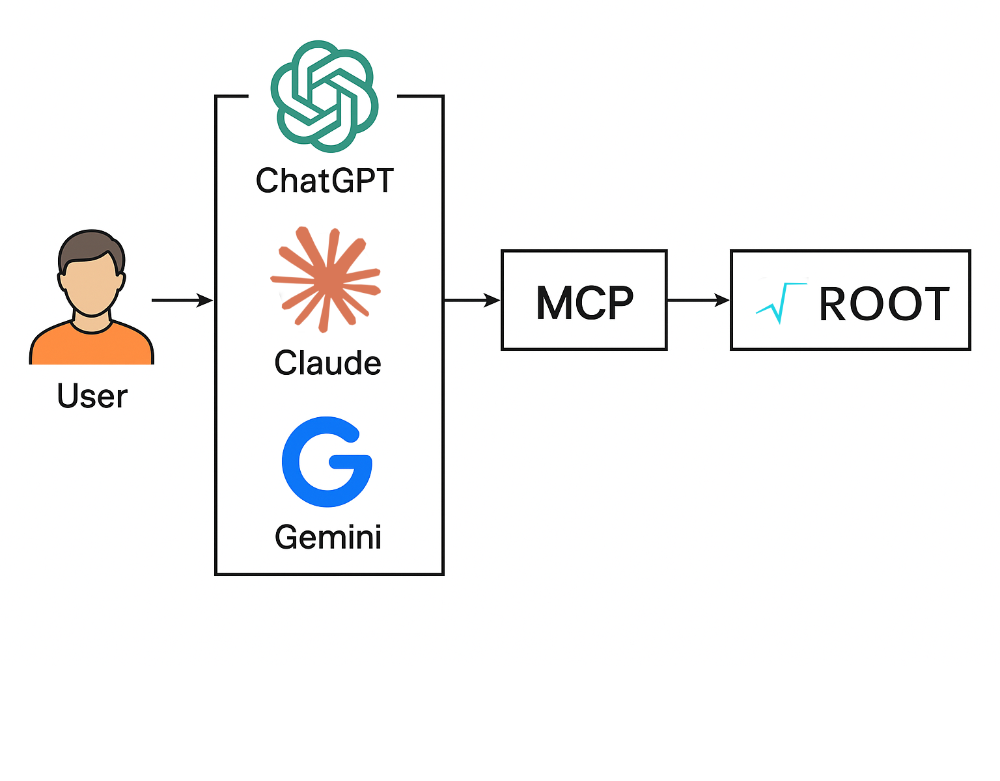

<div align="center">


# root-mcp: MCP Server for ROOT

**Model Context Protocol server for executing Python and C++ code with PyROOT**

[](https://root.cern/)
[](https://modelcontextprotocol.io/)
[](https://www.python.org/)

</div>

---

Minimal MCP (Model Context Protocol) server that allows LLMs and other MCP clients to execute Python and C++ code directly using PyROOT, without HTTP endpoints or external APIs.

## Features

- **Direct Python execution**: Run Python code with PyROOT available automatically
- **Direct C++ execution**: Run C++ code via ROOT's cling interpreter
- **In-process**: All code runs in the same process (no subprocess isolation)
- **Error detection**: Automatic detection of C++ compilation errors via return codes and stderr
- **Console logging**: Pretty-printed code execution with results in MCP console
- **Graphics support**: TCanvas and ROOT graphics objects with event loop support

## Architecture

Below is the architecture diagram for the `root_mcp_server` project. The image contains a visual representation of the components and their interactions.



Description (English):

- **MCP Client (VS Code / CLI / Programmatic)**: connects to the MCP server and sends execution requests. Clients can be interactive (e.g. VS Code + Copilot Chat) or scripted CLI clients.
- **FastMCP Server**: receives MCP tool calls (`root_python`, `root_cpp`) and dispatches them to the in-process executor.
- **RootExecutor (in-process PyROOT)**: runs Python or C++ code with the ROOT runtime, manages graphics mode, and can expose an embedded HTTP server (THttpServer) for interactive canvases.
- **ROOT Web Canvas (THttpServer / JSROOT)**: when graphics are enabled, canvases created in the ROOT session are available via the embedded HTTP server; clients can open the provided URL to inspect plots interactively.
- **Artifacts & Outputs**: execution results (stdout/stderr and error metadata) are returned to the MCP client; interactive canvases are accessible via the HTTP endpoint.

This architecture keeps ROOT running in-process for low-latency execution while providing a web-backed path for interactive visualization.

## Installation

### Prerequisites

- ROOT (6.x or later) with PyROOT enabled
- Python 3.10+

### Install the package

```bash
pip install -e .
```

## Usage

### Option 1: VS Code with GitHub Copilot Chat

The easiest way to use this MCP server is through VS Code with GitHub Copilot Chat.

#### 1. Install GitHub Copilot Chat extension

Make sure you have the **GitHub Copilot Chat** extension installed in VS Code.

#### 2. Configure MCP server in VS Code

Add the MCP server configuration to your VS Code settings. Open your `settings.json` (Ctrl/Cmd + Shift + P → "Preferences: Open User Settings (JSON)") and add:

```json
{
  "github.copilot.chat.codeGeneration.instructions": [
    {
      "text": "Use ROOT MCP server for data analysis"
    }
  ],
  "mcp.servers": {
		"root/mcp-server": {
			"type": "stdio",
			"command": "root-mcp",
			"args": []
		}
  }
}
```

**Important**: Replace `/path/to/ROOT/build/bin/thisroot.sh` with the actual path to your ROOT installation's `thisroot.sh` script.

#### 3. Use in Copilot Chat

Once configured, you can use the MCP tools in GitHub Copilot Chat:

```
@workspace Use #root_python to create a histogram with Gaussian distribution
```

```
@workspace Use #root_cpp to execute C++ code with ROOT
```

The server will automatically log executed code and results to the MCP console (visible in VS Code's Output panel).

### Option 2: Command line

Start the MCP server directly:

```bash
root-mcp
```

### Option 3: Programmatic usage

```python
from mcp.client.stdio import stdio_client, StdioServerParameters
from mcp.client.session import ClientSession

server_params = StdioServerParameters(
    command="bash",
    args=["-lc", "source /path/to/thisroot.sh && python3 -m root_mcp_server.cli"],
    env=None
)

async with stdio_client(server_params) as (read, write):
    async with ClientSession(read, write) as session:
        await session.initialize()

        # Execute Python code
        result = await session.call_tool("root_python", arguments={
            "code": "import ROOT; print(ROOT.gROOT.GetVersion())"
        })
        print(result)
```

## Available Tools

The server exposes two MCP tools:

### 1. `root_python`

Execute Python code with `ROOT` automatically available in scope.

**Arguments:**
- `code` (string): Python code to execute

**Returns:**
```json
{
  "ok": boolean,
  "stdout": string,
  "stderr": string,
  "error": string | null,
  "error_type": string | null
}
```

**Example:**
```python
code = """
import ROOT
h = ROOT.TH1F("h", "Gaussian", 100, -5, 5)
for i in range(10000):
    h.Fill(ROOT.gRandom.Gaus(0, 1))
print(f"Mean: {h.GetMean():.3f}")
"""
```

### 2. `root_cpp`

Execute C++ code via ROOT's cling interpreter.

**Arguments:**
- `code` (string): C++ code to execute

**Returns:**
```json
{
  "ok": boolean,
  "stdout": string,
  "stderr": string,
  "error": string | null,
  "error_type": string | null
}
```

**Example:**
```cpp
TH1F* h = new TH1F("h", "Gaussian;X;Y", 100, -5, 5);
for(int i=0; i<10000; i++) h->Fill(gRandom->Gaus(0,1));
TCanvas* c = new TCanvas("c", "Canvas", 900, 600);
h->Draw();
c->Update();
std::cout << "Mean: " << h->GetMean() << std::endl;
```

## Features in Detail

### Error Detection

The server automatically detects C++ compilation errors by:
- Checking the return code from `ROOT.gInterpreter.ProcessLine()`
- Scanning stderr for error keywords (`error:`, `Error:`, `fatal error:`)

Errors are reported with `ok=false` and detailed error messages.

### Console Logging

All code execution is logged to stderr (MCP console) with:
- Pretty-printed code with line numbers
- Execution status (✓ success / ❌ failure)
- Complete stdout, stderr, and error details

Example output:
```
============================================================
EXECUTING PYTHON CODE:
  1 | import ROOT
  2 | print(ROOT.gROOT.GetVersion())
============================================================
✓ EXECUTION SUCCESS
STDOUT:
6.39/01
```

### Graphics Support

The server initializes `TApplication` and supports ROOT graphics:
- TCanvas windows (batch mode can be disabled)
- Histogram plotting
- ROOT event loop for interactive graphics
- Object persistence to prevent garbage collection

## Development

### Running tests

```bash
# Test basic functionality
python test_mcp_client.py

# Test persistent graphics
python test_persistent_window.py

# Test histogram creation
python test_histogram.py
```

### Project Structure

```
root_mcp_server/
├── root_mcp_server/
│   ├── __init__.py
│   ├── cli.py          # Entry point
│   ├── executor.py     # Code execution 
│   └── server.py       # MCP server definition
├── test_mcp_client.py
├── test_persistent_window.py
├── test_histogram.py
└── README.md
```

## License

See LICENSE file.

## Contributing

Contributions are welcome! Please feel free to submit a Pull Request.

## Acknowledgments

- Built with the [Model Context Protocol](https://modelcontextprotocol.io/)
- Powered by [ROOT](https://root.cern/) from CERN
